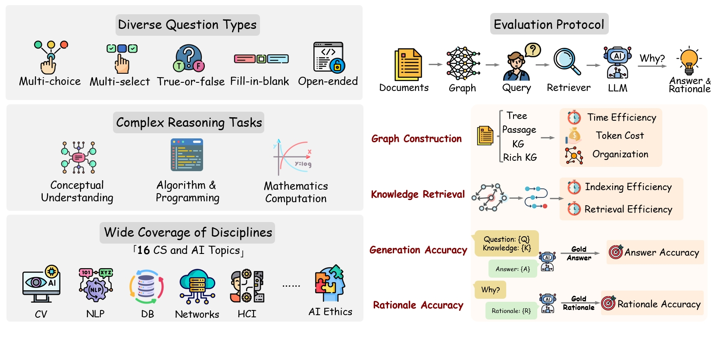
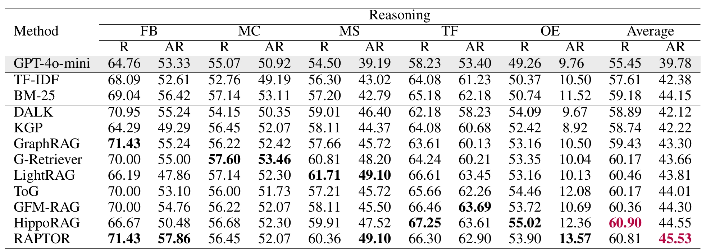
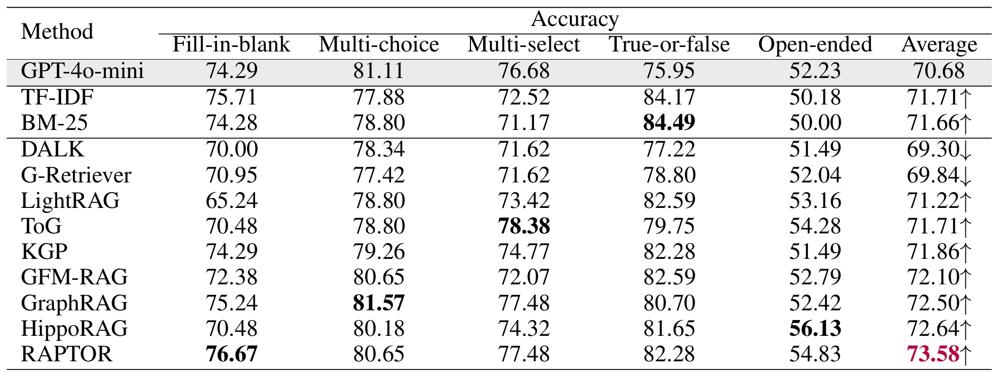

# GraphRAG-Bench
This is the official repo for GraphRAG-Bench: Challenging Domain-Specific Reasoning for Evaluating Graph Retrieval-Augmented Generation

<div align="left">
   <p>
   <a href='https://deep-polyu.github.io/RAG/'></a>
   <a href='https://arxiv.org/abs/2506.02404'></a>
   <a href='https://huggingface.co/datasets/jeremycp3/GraphRAG-Bench'></a>
  </p>
</div>

## 🎉 News
- **[2025-06-03]** The official leaderboard is released here: [GraphRAG-Bench leaderboard](https://deep-polyu.github.io/RAG/).
- **[2025-06-03]** We have released the paper [GraphRAG-Bench](https://arxiv.org/abs/2506.02404).
- **[2025-06-03]** We have released the dataset [GraphRAG-Bench](https://huggingface.co/datasets/jeremycp3/GraphRAG-Bench).


## 🏆 Leaderboard
The official leaderboard could be found hereunder:
[GraphRAG-Bench leaderboard](https://deep-polyu.github.io/RAG/)

## 📚 Dataset
It contains 5 question types spanning 16 disciplines and a corpus of 7 million words from 20 computer science textbooks. The structure of the dataset is shown below:

### ❓ Question
We defined five types of questions:
- Fill-in-blank
- Multi-choice
- Multi-select
- True-or-false
- Open-ended
```
Question/
├── FB.jsonl   #Fill-in-blank
├── MC.jsonl   #Multi-choice
├── MS.jsonl   #Multi-select
├── OE.jsonl   #True-or-false
├── TF.jsonl   #Open-ended
```

```
Question example (Open-ended)
{
"Question": "Why is it necessary for the server to use a special initial sequence number in the \n SYNACK?",
 "Level-1 Topic": "Computer networks", 
 "Level-2 Topic": "Network protocols and architectures", 
 "Rationale": "The server uses a special initial sequence number (ISN) in the SYN-ACK to ensure unique connection identification and proper packet sequencing. This also mitigates SYN flood attacks by making it harder for attackers to predict ISNs and hijack sessions.", 
 "Answer": "In order to defend itself against SYN FLOOD attack."
 }

```
### 📄 Corpus
We parsed out the images and content of the textbook. If you only need text content, use .md files (ecommend). If you need metadata, use _structured.json or _content_list.json files. The presence of image supports multi-modal RAG methods.

```
Corpus/
├── Algorithms/   #Textbook name
│    ├── image
│    ├── Algorithms.md
│    ├── Algorithms_structured.json
│    └── Algorithms_content_list.json
│...
├── Database system concepts/...
└── Speech and Language Processing/...

```

## ⚖️ Evaluator
We provide the evaluator.py for evaluation. Place your output files in the following structure:
```
data_name/
├── question/
│   ├── FB.jsonl
│   ├── MC.jsonl
│   ├── MS.jsonl
│   ├── OE.jsonl
│   └── TF.jsonl
├── output/
│   ├── GraphRAG-Bench_FB
│   ├── GraphRAG-Bench_MC
│   ├── GraphRAG-Bench_MS
│   ├── GraphRAG-Bench_OE
│   └── GraphRAG-Bench_TF
└── results_tmp.json (Generated after the code is run)
```

## 🧪 Experiments
### Reasoning
Reasoning score R is to evaluate the semantic correspondence and reasoning consistency with gold rationale. The AR metric is to determine whether the model is able to provide correct reasoning when it answers the question accurately.

### Accuracy
Accuracy evaluates whether the generated results are consistent with the groundtruth.

## ✉️ Citation

If you find this repository helpful, please consider citing our paper:

```bibtex
@article{xiao2025graphrag,
  title={GraphRAG-Bench: Challenging Domain-Specific Reasoning for Evaluating Graph Retrieval-Augmented Generation},
  author={Xiao, Yilin and Dong, Junnan and Zhou, Chuang and Dong, Su and Zhang, Qianwen and Yin, Di and Sun, Xing and Huang, Xiao},
  journal={arXiv preprint arXiv:2506.02404},
  year={2025}
}
```

